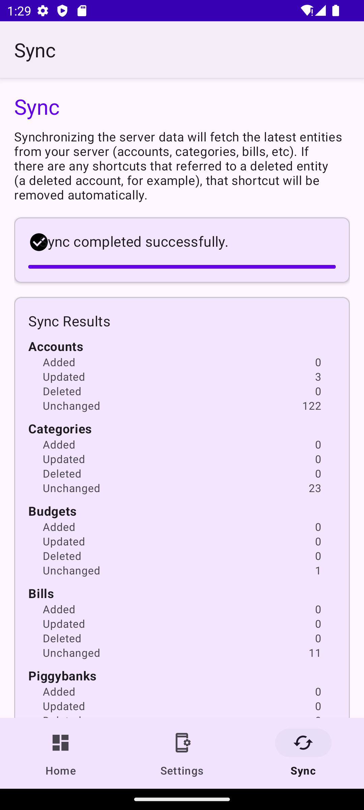
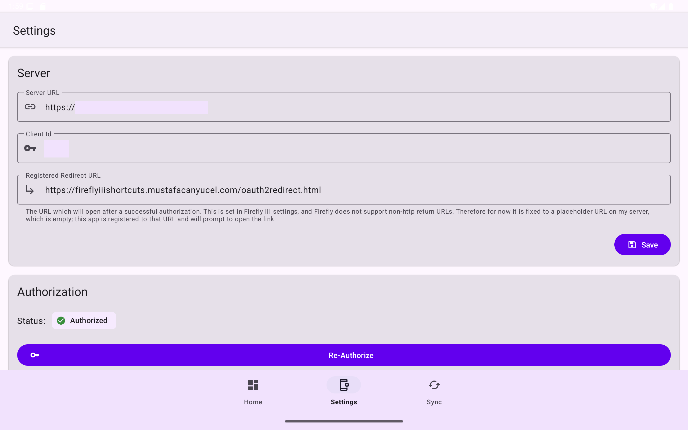

# Firefly III Shortcuts

A modern Android application that simplifies daily financial transactions
with [Firefly III](https://www.firefly-iii.org/), the popular open-source personal finance manager.

## Table of Contents
- [Why?](#why)
- [Features](#features)
- [What is that weird return url? Are you stealing my finance records?](#what-is-that-weird-return-url-are-you-stealing-my-finance-records)
   - [Technical Shenanigans](#technical-shenanigans)
- [Widget](#widget)
- [Screenshots](#screenshots)
   - [Phone](#phone)
   - [Tablet](#tablet)
- [It's not a Feature, It is a Bug](#its-not-a-feature-it-is-a-bug)
- [Installation](#installation)
   - [Google Play](#google-play)
   - [Manual Installation](#manual-installation)
- [Setup](#setup)
- [Application Architecture](#application-architecture)
   - [Tech Stack](#tech-stack)
- [Building from Source](#building-from-source)
   - [Prerequisites](#prerequisites)
   - [Build Steps](#build-steps)
- [Contributing](#contributing)
   - [Development Guidelines](#development-guidelines)
- [License](#license)
- [Related Projects](#related-projects)
- [Acknowledgements](#acknowledgements)
- [Contact](#contact)

## Why?

Trying to keep records of my transactions is something that I always start with an intent of doing indefinitely, but
almost always I begin to skip some items because I am too lazy to open the page/app, enter all the details (from, to, tags, accounts, bills, amount, etc).
What I needed was to save my repeated transactions as templates (*shortcuts*, as you may), and then run them whenever I needed, with a single tap.

## Features

- **Quick Transaction Shortcuts**: Create and use shortcuts for your common financial transactions
- **Quick Run Widget**: All the shortcuts can be run from your home screen via the widget; no need to even open the application.
- **Clean UI**: Modern Material 3 design with intuitive navigation
- **Secure**: Your financial data stays on your device with secure API token storage, obtained by OAuth2
- **Fast Synchronization**: Efficient data syncing with Firefly III server

## What is that weird return url? Are you stealing my finance records?

Well, I can't even deal with my own records, so no, I am not pursuing yours. 

### Technical Shenanigans
Once the OAuth sequence is completed, the server will redirect you to a location with a token that proves you have allowed access. Normally, an app link
(a url starting with app://) is perfect for mobile apps since they can capture these links and there cannot be a web page 
starting with app. However, Firefly III API does not support return urls that do not conform to HTTP or HTTPS scheme, so using an app:// link is impossible. 
I could have entered a dummy url (like example.com), but for the Android Secure Deep Linking, I need to prove the ownership of the domain. So I created the subdomain fireflyiiishortcuts.mustafacanyucel.com, and used it as the default.
I also added a very basic page that has nothing in except few lines to explain the purpose of the app. If you encounter the second *It's not a Bug, It's a Feature*,
you will see this page. 

You may ask why not make this return url parameter customizable, but AFAIK you have to hardcode the intent filter target urls to the AndroidManifest.xml file as they
are necessary during compilation. If you wish, you can change this in the manifest file and build the app from the source. 

## Widget

The widget allows to run shortcuts from the home screen. The widget is also fully responsive in terms of 
execution state (not screen size and fit); it will reflect the execution status of each shortcut in real time.

## Screenshots

### Phone





### Tablet





## It's not a Feature, It is a Bug

[] On authentication, when you log in to your Firefly server for the first time, the Firefly server redirects you to 
the home page rather than the authentication page. I think the server loses the return url and just redirects to 
its home page. You can just close the auth window to go back to the app, and tap authenticate button again. Note that 
you don't need to save the credentials, the system browser session will allow you to log in without needing to enter 
your credentials again (for a short duration). I am not sure this can be fixed from this app side.

[] On authentication, if you try to authenticate an already authenticated client, the server redirects you to the 
return url correctly with the token and everything, however, Android OS fails to capture the below intent filter:

```xml
 <data
     android:host="fireflyiiishortcuts.mustafacanyucel.com"
     android:path="/oauth2redirect.html"
     android:pathPattern="/oauth2redirect.html"
     android:scheme="https" />
```

Even though the response of the initial (first) and the latter auth return urls are identical (I think), only the 
initial is captured, and the latter is not. If you want to re-authenticate, you can just revoke the app access
from the server for now. I will take a look at it soon.

[] On some tablets, the top app bar conceals some of the views because the views start from the screen edge rather than
the app bar bottom. This behavior is unpredictable, so it may need some time to fix.

## Installation

### Google Play

*TBA*

### Manual Installation

1. Download the latest APK from
   the [Releases](https://github.com/mustafacanyucel/fireflyiii-shortcuts/releases) page
2. Enable installation from unknown sources in your device settings
3. Install the downloaded APK

## Setup

1. **Firefly III Server**: You need a working Firefly III instance. Self-host or use a hosted
   option.
2. **API Token**: Generate a Personal Access Token in your Firefly III instance.
3. **Configure the App**:
    - Enter your Firefly III server URL
    - Add your Personal Access Token
    - Test the connection and sync your data

## Application Architecture

This application follows modern Android development practices and architecture:

- **MVVM Architecture**: Clear separation of UI, business logic, and data
- **Clean Architecture**: Domain-driven design with clear boundaries between layers
- **Repository Pattern**: Unified data access layer with offline first approach
- **Kotlin**: 100% Kotlin with coroutines and flow for asynchronous operations
- **Jetpack Components**: Room, ViewModel, LiveData, Navigation, and more

### Tech Stack

- **Kotlin**: Modern, concise language for Android development
- **Coroutines + Flow**: For asynchronous operations and reactive streams
- **Hilt**: Dependency injection for clean, modular code
- **Room**: Local database for offline support
- **Retrofit**: Type-safe HTTP client for API communication
- **Material 3**: Modern Android UI components

## Building from Source

### Prerequisites

- Android Studio (latest stable version)
- Kotlin 1.7.0+
- Android SDK 33+
- JDK 11+

### Build Steps

1. Clone the repository:
   ```bash
   git clone https://github.com/mustafacanyucel/fireflyiii-shortcuts.git
   ```

2. Open the project in Android Studio

3. Sync the project with Gradle files

4. Build the project:
   ```bash
   ./gradlew assembleDebug
   ```

5. Install the debug build:
   ```bash
   ./gradlew installDebug
   ```

## Contributing

Contributions are welcome! Please feel free to submit a Pull Request.

1. Fork the project
2. Create your feature branch (`git checkout -b feature/amazing-feature`)
3. Commit your changes (`git commit -m 'Add some amazing feature'`)
4. Push to the branch (`git push origin feature/amazing-feature`)
5. Open a Pull Request

Please make sure your code follows the project's coding style and includes appropriate tests.

### Development Guidelines

- Follow Kotlin coding conventions
- Write unit tests for new code
- Update documentation for significant changes
- Ensure backward compatibility

## License

This project is licensed under the MIT License - see the [LICENSE](LICENSE) file for details.

## Related Projects

- [Firefly III](https://github.com/firefly-iii/firefly-iii): The core personal finance manager
- [Firefly III API Docs](https://api-docs.firefly-iii.org/): Documentation for the Firefly III API

## Acknowledgements

- Thanks to [James Cole](https://github.com/JC5) for creating Firefly III
- All contributors to the Firefly III ecosystem
- The Android open-source community for their amazing libraries and tools

## Contact

Mustafa Can Yücel - [@mustafacanyucel](https://github.com/mustafacanyucel)

Project
Link: [https://github.com/mustafacanyucel/fireflyiii-shortcuts](https://github.com/mustafacanyucel/fireflyiii-shortcuts)

---


If this app helps you manage your finances better, consider donating to Firefly III or supporting
this project!